# Домашнее задание к занятию 4 «Оркестрация группой Docker контейнеров на примере Docker Compose» - `Рахманов Александр`

### Инструкция к выполению

1. Для выполнения заданий обязательно ознакомьтесь с [инструкцией](https://github.com/netology-code/devops-materials/blob/master/cloudwork.MD) по экономии облачных ресурсов. Это нужно, чтобы не расходовать средства, полученные в результате использования промокода.
2. Практические задачи выполняйте на личной рабочей станции или созданной вами ранее ВМ в облаке.
3. Своё решение к задачам оформите в вашем GitHub репозитории в формате markdown!!!
4. В личном кабинете отправьте на проверку ссылку на .md-файл в вашем репозитории.

---

## Задача 1

Сценарий выполнения задачи:
- Установите docker и docker compose plugin на свою linux рабочую станцию или ВМ.
- Если dockerhub недоступен создайте файл /etc/docker/daemon.json с содержимым: ```{"registry-mirrors": ["https://mirror.gcr.io", "https://daocloud.io", "https://c.163.com/", "https://registry.docker-cn.com"]}```
- Зарегистрируйтесь и создайте публичный репозиторий  с именем "custom-nginx" на https://hub.docker.com (ТОЛЬКО ЕСЛИ У ВАС ЕСТЬ ДОСТУП);
- скачайте образ nginx:1.29.0;
- Создайте Dockerfile и реализуйте в нем замену дефолтной индекс-страницы(/usr/share/nginx/html/index.html), на файл index.html с содержимым:
```
<html>
<head>
Hey, Netology
</head>
<body>
<h1>I will be DevOps Engineer!</h1>
</body>
</html>
```
- Соберите и отправьте созданный образ в свой dockerhub-репозитории c tag 1.0.0 (ТОЛЬКО ЕСЛИ ЕСТЬ ДОСТУП). 
- Предоставьте ответ в виде ссылки на https://hub.docker.com/<username_repo>/custom-nginx/general .

## Ответ

[Ссылка на созданный образ в dockerhub-репозитории](https://hub.docker.com/repository/docker/slov1977/custom-nginx/general)

---

## Задача 2

1. Запустите ваш образ custom-nginx:1.0.0 командой docker run в соответвии с требованиями:
- имя контейнера "ФИО-custom-nginx-t2"
- контейнер работает в фоне
- контейнер опубликован на порту хост системы 127.0.0.1:8080
2. Не удаляя, переименуйте контейнер в "custom-nginx-t2"
3. Выполните команду ```date +"%d-%m-%Y %T.%N %Z" ; sleep 0.150 ; docker ps ; ss -tlpn | grep 127.0.0.1:8080  ; docker logs custom-nginx-t2 -n1 ; docker exec -it custom-nginx-t2 base64 /usr/share/nginx/html/index.html```
4. Убедитесь с помощью curl или веб браузера, что индекс-страница доступна.

В качестве ответа приложите скриншоты консоли, где видно все введенные команды и их вывод.

## Ответ


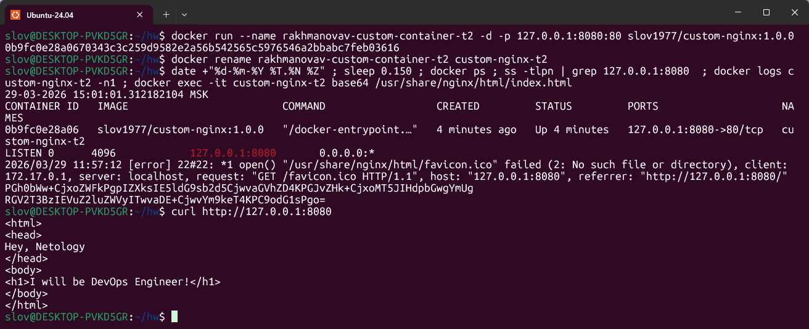

---

## Задача 3

1. Воспользуйтесь docker help или google, чтобы узнать как подключиться к стандартному потоку ввода/вывода/ошибок контейнера "custom-nginx-t2".
2. Подключитесь к контейнеру и нажмите комбинацию Ctrl-C.
3. Выполните ```docker ps -a``` и объясните своими словами почему контейнер остановился.
4. Перезапустите контейнер
5. Зайдите в интерактивный терминал контейнера "custom-nginx-t2" с оболочкой bash.
6. Установите любимый текстовый редактор(vim, nano итд) с помощью apt-get.
7. Отредактируйте файл "/etc/nginx/conf.d/default.conf", заменив порт "listen 80" на "listen 81".
8. Запомните(!) и выполните команду ```nginx -s reload```, а затем внутри контейнера ```curl http://127.0.0.1:80 ; curl http://127.0.0.1:81```.
9. Выйдите из контейнера, набрав в консоли  ```exit``` или Ctrl-D.
10. Проверьте вывод команд: ```ss -tlpn | grep 127.0.0.1:8080``` , ```docker port custom-nginx-t2```, ```curl http://127.0.0.1:8080```. Кратко объясните суть возникшей проблемы.
11. * Это дополнительное, необязательное задание. Попробуйте самостоятельно исправить конфигурацию контейнера, используя доступные источники в интернете. Не изменяйте конфигурацию nginx и не удаляйте контейнер. Останавливать контейнер можно. [пример источника](https://www.baeldung.com/linux/assign-port-docker-container)
12. Удалите запущенный контейнер "custom-nginx-t2", не останавливая его.(воспользуйтесь --help или google)

В качестве ответа приложите скриншоты консоли, где видно все введенные команды и их вывод.

## Ответ


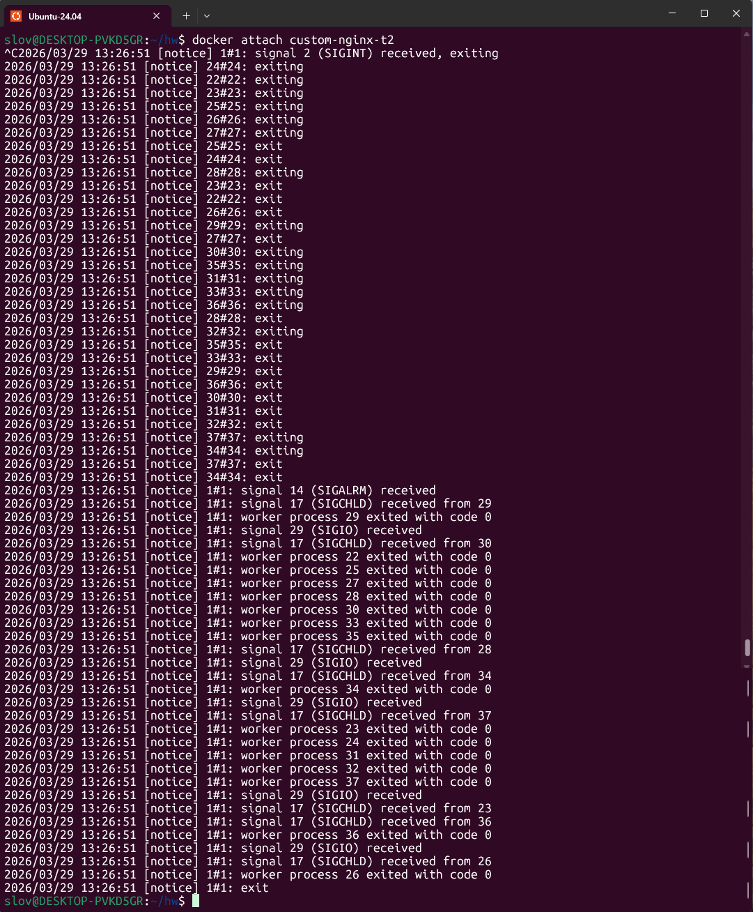


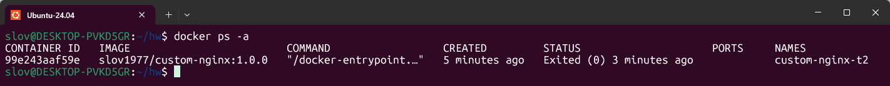


Комбинация ```Ctrl-C``` передает контейнеру сигнал ```SIGINT```, тем самым завершает его основной процесс и контейнер останавливается.


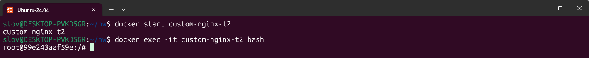


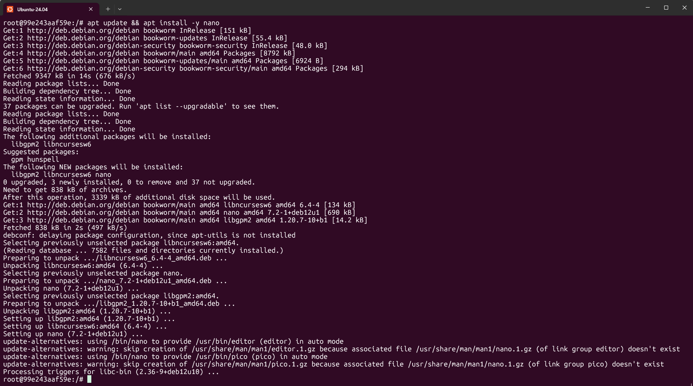


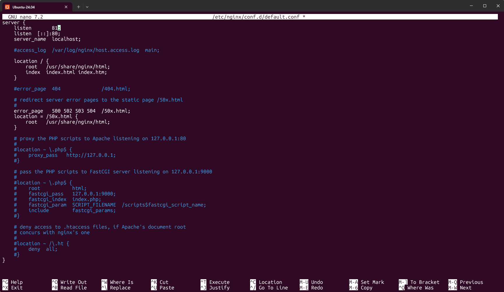


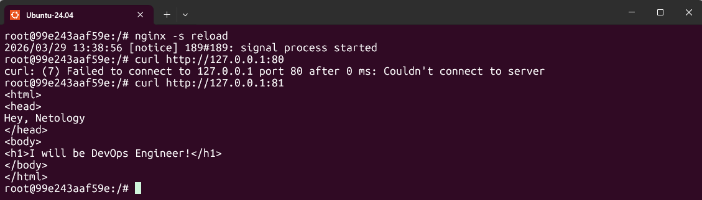


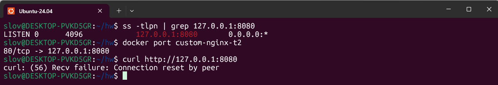


Проблема заключается в том, что мы изменили порт, который слушает ```nginx```, с ```80``` на ```81```, а сопоставление портов запущенного докер контейнера и хоста осталось прежним.


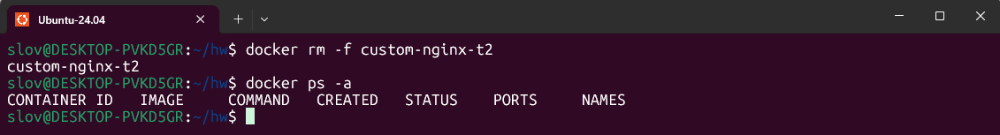

---

## Задача 4

- Запустите первый контейнер из образа ***centos*** c любым тегом в фоновом режиме, подключив папку  текущий рабочий каталог ```$(pwd)``` на хостовой машине в ```/data``` контейнера, используя ключ -v.
- Запустите второй контейнер из образа ***debian*** в фоновом режиме, подключив текущий рабочий каталог ```$(pwd)``` в ```/data``` контейнера. 
- Подключитесь к первому контейнеру с помощью ```docker exec``` и создайте текстовый файл любого содержания в ```/data```.
- Добавьте ещё один файл в текущий каталог ```$(pwd)``` на хостовой машине.
- Подключитесь во второй контейнер и отобразите листинг и содержание файлов в ```/data``` контейнера.

В качестве ответа приложите скриншоты консоли, где видно все введенные команды и их вывод.

## Ответ


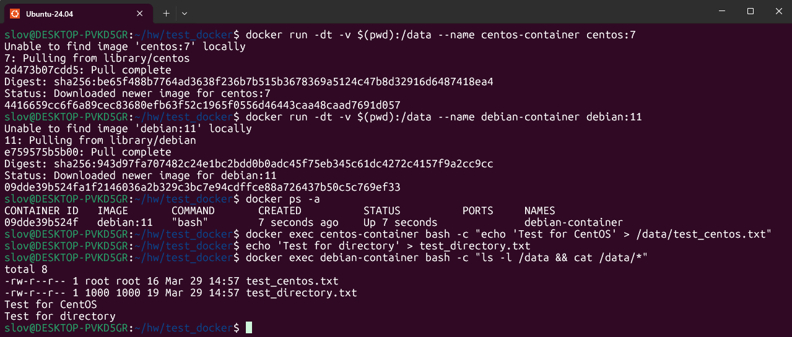

---

## Задача 5

1. Создайте отдельную директорию(например /tmp/netology/docker/task5) и 2 файла внутри него.
"compose.yaml" с содержимым:
```
version: "3"
services:
  portainer:
    network_mode: host
    image: portainer/portainer-ce:latest
    volumes:
      - /var/run/docker.sock:/var/run/docker.sock
```
"docker-compose.yaml" с содержимым:
```
version: "3"
services:
  registry:
    image: registry:2

    ports:
    - "5000:5000"
```

И выполните команду "docker compose up -d". Какой из файлов был запущен и почему? (подсказка: https://docs.docker.com/compose/compose-application-model/#the-compose-file )

2. Отредактируйте файл compose.yaml так, чтобы были запущенны оба файла. (подсказка: https://docs.docker.com/compose/compose-file/14-include/)

3. Выполните в консоли вашей хостовой ОС необходимые команды чтобы залить образ custom-nginx как custom-nginx:latest в запущенное вами, локальное registry. Дополнительная документация: https://distribution.github.io/distribution/about/deploying/
4. Откройте страницу "https://127.0.0.1:9000" и произведите начальную настройку portainer.(логин и пароль адмнистратора)
5. Откройте страницу "http://127.0.0.1:9000/#!/home", выберите ваше local  окружение. Перейдите на вкладку "stacks" и в "web editor" задеплойте следующий компоуз:

```
version: '3'

services:
  nginx:
    image: 127.0.0.1:5000/custom-nginx
    ports:
      - "9090:80"
```
6. Перейдите на страницу "http://127.0.0.1:9000/#!/2/docker/containers", выберите контейнер с nginx и нажмите на кнопку "inspect". В представлении <> Tree разверните поле "Config" и сделайте скриншот от поля "AppArmorProfile" до "Driver".

7. Удалите любой из манифестов компоуза(например compose.yaml).  Выполните команду "docker compose up -d". Прочитайте warning, объясните суть предупреждения и выполните предложенное действие. Погасите compose-проект ОДНОЙ(обязательно!!) командой.

В качестве ответа приложите скриншоты консоли, где видно все введенные команды и их вывод, файл compose.yaml , скриншот portainer c задеплоенным компоузом.

## Ответ


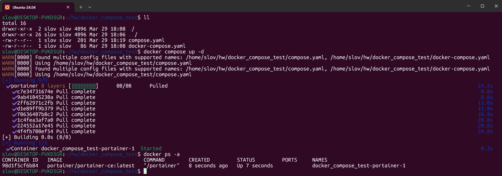


По умолчанию ```Docker Compose``` запускает ```compose.yaml``` (предпочтительный) или ```compose.yml```.  
```Docker Compose``` также поддерживает ```docker-compose.yaml``` и ```docker-compose.yml``` для обеспечения обратной совместимости с более ранними версиями.  
Но если в рабочем каталоге присутствуют и ```compose.yaml```, и ```docker-compose.yaml```, ```Docker Compose``` выполнит ```compose.yaml```.


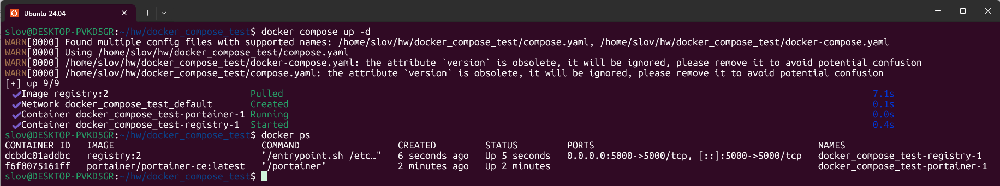


[Отредактированный compose.yaml для запуска двух файлов](https://github.com/SLOV1977/05-virt-03-docker-intro/tree/main/compose.yaml)

```
version: "3"

include:
  - docker-compose.yaml

services:
  portainer:
    image: portainer/portainer-ce:latest
    network_mode: host
    volumes:
      - /var/run/docker.sock:/var/run/docker.sock
```


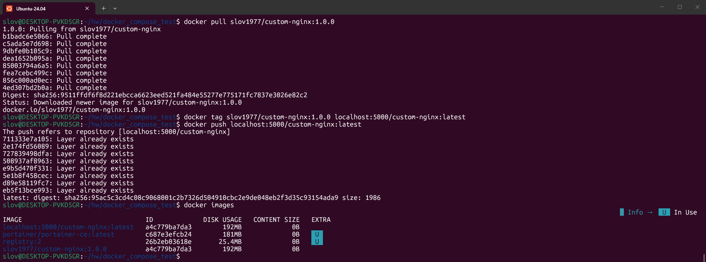


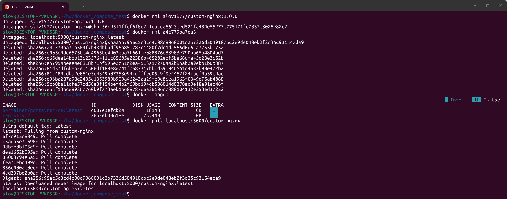


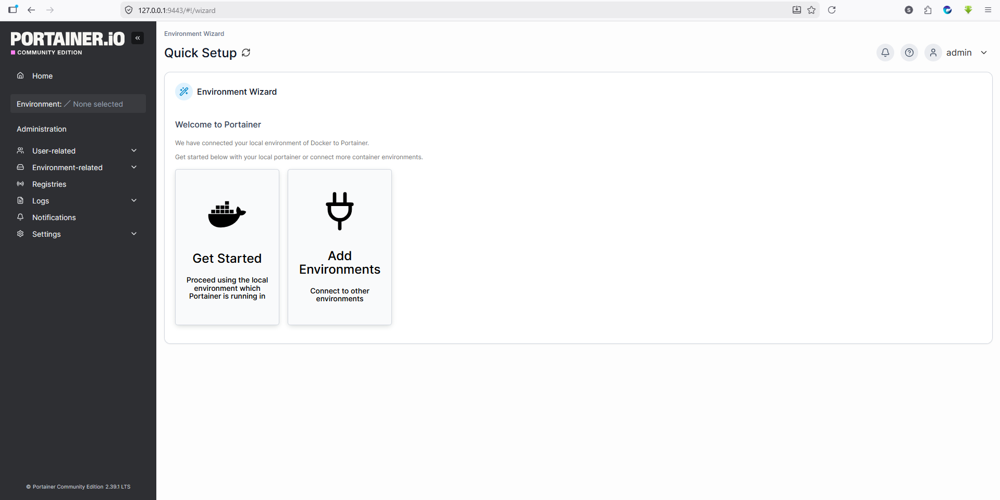


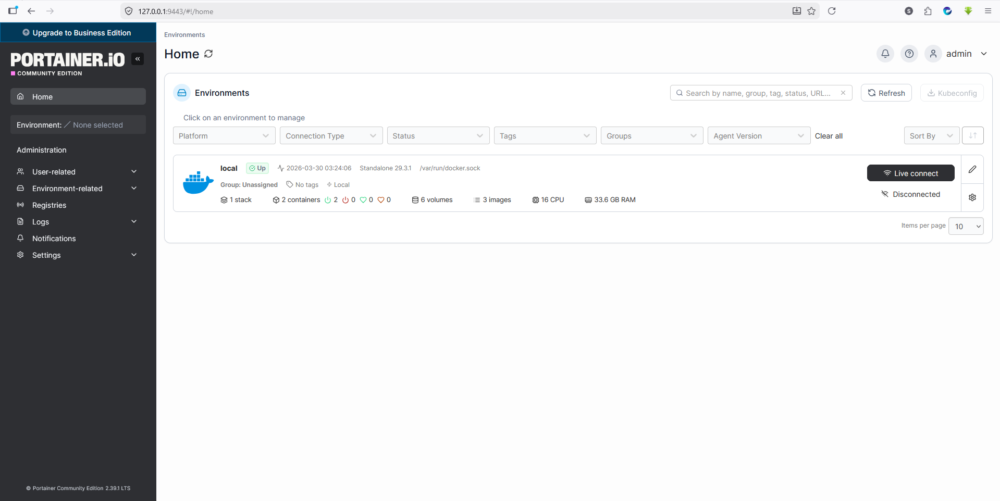


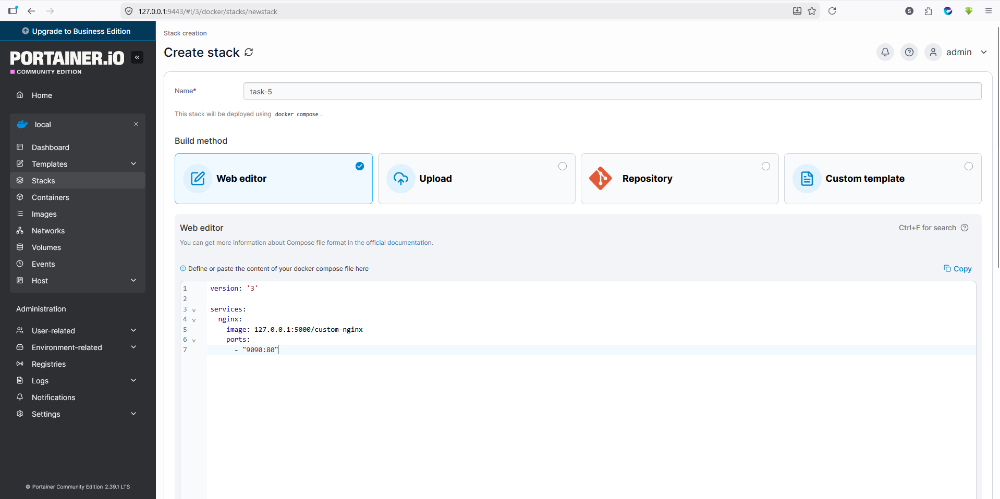


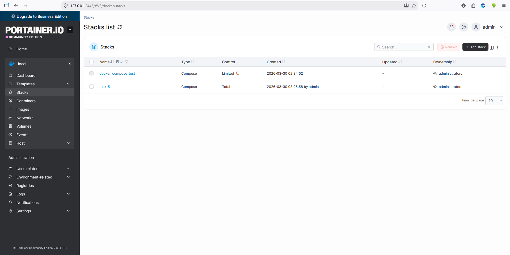


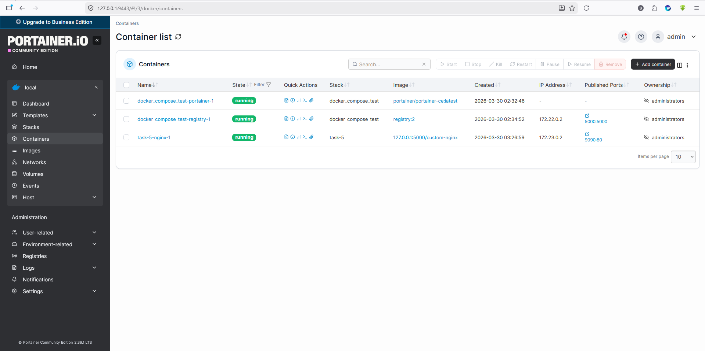


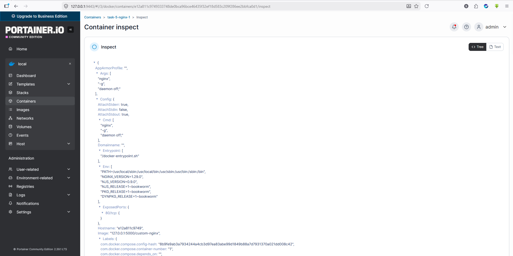


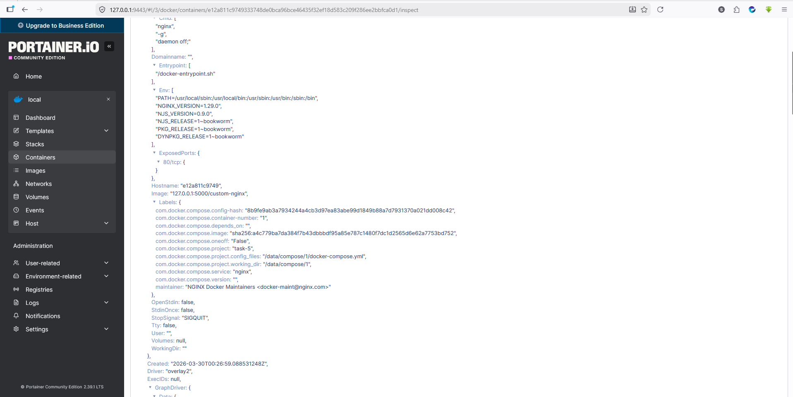


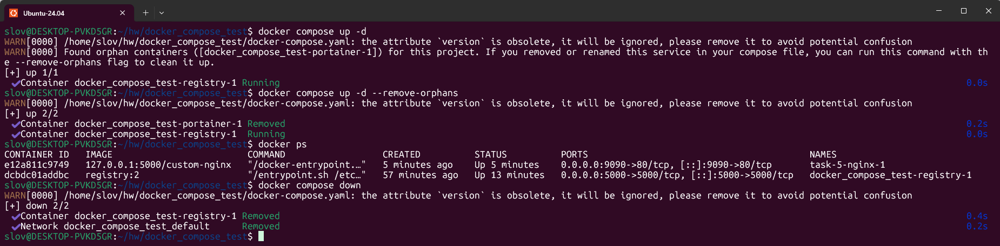


Предупреждение ```"Found orphan containers ([docker_compose_test-portainer-1]) for this project. If you removed or renamed this service in your compose file, you can run this command with the --remove-orphans flag to clean it up."``` говорит о том, что найдены контейнеры, которые не описаны в файле ```docker-compose.yaml``` и предлагает удалить его выполнив команду ```docker compose up -d``` с флагом ```--remove-orphans```.

---

### Правила приема

Домашнее задание выполните в файле readme.md в GitHub-репозитории. В личном кабинете отправьте на проверку ссылку на .md-файл в вашем репозитории.


